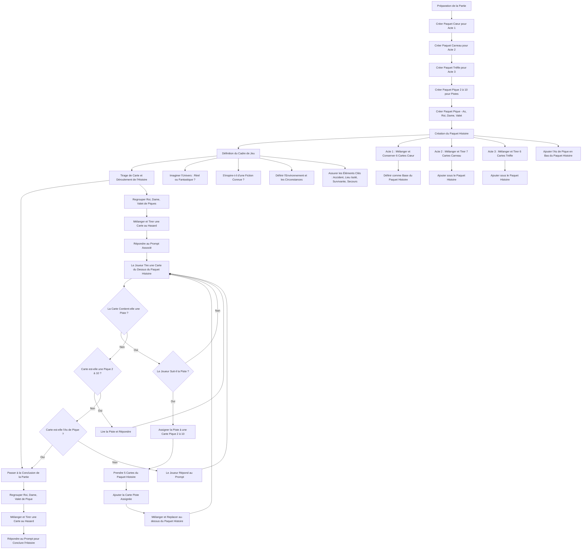

```mermaid:
flowchart TD
    %% Début du flux principal
    A[Préparation de la Partie] --> A1[Créer Paquet Cœur pour Acte 1]
    A1 --> A2[Créer Paquet Carreau pour Acte 2]
    A2 --> A3[Créer Paquet Trèfle pour Acte 3]
    A3 --> A4[Créer Paquet Pique 2 à 10 pour Pistes]
    A4 --> A5[Créer Paquet Pique - As, Roi, Dame, Valet]
    A5 --> B[Création du Paquet Histoire]
    B --> C[Définition du Cadre de Jeu]
    C --> D[Tirage de Carte et Déroulement de l'Histoire]
    D --> E[Conclusion de la Partie]

    %% Détails de chaque étape
    B --> B1[Acte 1 : Mélanger et Conserver 6 Cartes Cœur]
    B1 --> B2[Définir comme Base du Paquet Histoire]
    B --> B3[Acte 2 : Mélanger et Tirer 7 Cartes Carreau]
    B3 --> B4[Ajouter sous le Paquet Histoire]
    B --> B5[Acte 3 : Mélanger et Tirer 6 Cartes Trèfle]
    B5 --> B6[Ajouter sous le Paquet Histoire]
    B --> B7[Ajouter l'As de Pique en Bas du Paquet Histoire]

    %% Définition du cadre de jeu.
    C --> C1[Imaginer l'Univers : Réel ou Fantastique ?]
    C --> C2[S'inspire-t-il d'une Fiction Connue ?]
    C --> C3[Définir l'Environnement et les Circonstances]
    C --> C4[Assurer les Éléments Clés : Accident, Lieu Isolé, Survivante, Secours]

    %% Début de la partie.
    D --> D1[Regrouper Roi, Dame, Valet de Piques]
    D1 --> D2[Mélanger et Tirer une Carte au Hasard]
    D2 --> D3[Répondre au Prompt Associé]

    %% Déroulement de la partie.
    D3 --> D4[Le Joueur Tire une Carte du Dessus du Paquet Histoire]
    D4 --> D15{La Carte Contient-elle une Piste ?}
    D15 --> |Oui| D7{Le Joueur Suit-il la Piste ?}
    D15 --> |Non| D5{Carte est-elle une Pique 2 à 10 ?}
    D5 --> |Oui| D6[Lire la Piste et Répondre]
    D6 --> D4
    D5 --> |Non| D13{Carte est-elle l'As de Pique ?}
    D13 --> |Oui| E[Passer à la Conclusion de la Partie]
    D13 --> |Non| D14[Le Joueur Répond au Prompt]
    D14 --> D4

    D7 --> |Oui| D8[Assigner la Piste à une Carte Pique 2 à 10]
    D8 --> D9[Prendre 5 Cartes du Paquet Histoire]
    D9 --> D10[Ajouter la Carte Piste Assignée]
    D10 --> D11[Mélanger et Replacer au-dessus du Paquet Histoire]
    D11 --> D4
    D7 --> |Non| D4

    %% Conclusion de la partie.
    E --> E1[Regrouper Roi, Dame, Valet de Pique]
    E1 --> E2[Mélanger et Tirer une Carte au Hasard]
    E2 --> E3[Répondre au Prompt pour Conclure l'Histoire]
```
